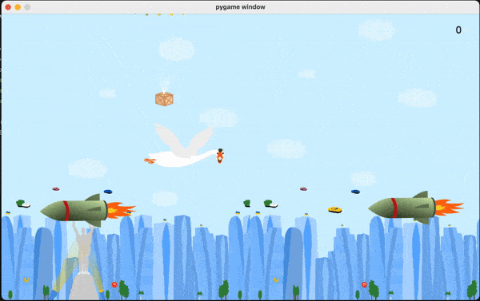

Sample Game using Pygame
========================

This repository contains the source code for a simple game created using the Pygame library.

### Installation

You'll need to have Pygame installed on your system to run this game. You can install it using the following command in your terminal:

    $ pip install pygame

### Running the Game

Once Pygame is installed, you can run the game by executing the main script: 

    $ python main.py

### Getting Started

This sample game provides a basic framework for building Pygame games. It demonstrates essential concepts like:

* Initialization (setting up the game window and screen)
* Game loop (main program loop)
* Event handling (processing user input)
* Drawing graphics (creating visual elements using Pygame's drawing functions)

### Further Exploration

Pygame offers many features and possibilities for creating more complex and engaging games. Here are some resources to help you expand your Pygame knowledge:

* [Official Pygame Documentation](https://www.pygame.org/docs/)
* [Pygame Tutorial](https://realpython.com/lessons/basic-pygame-program/)